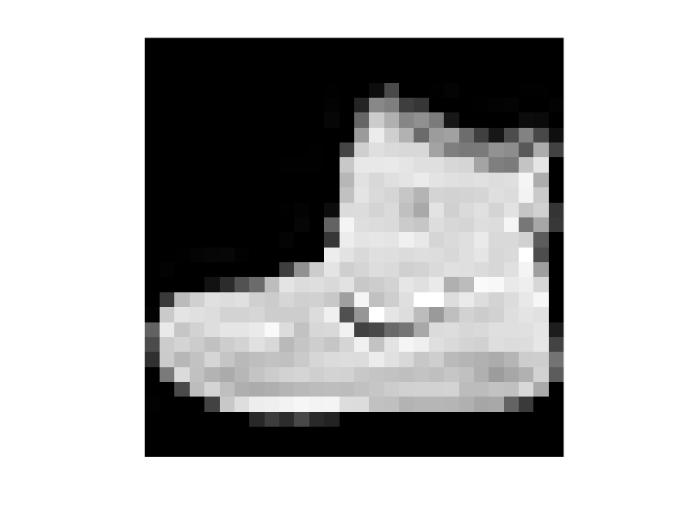
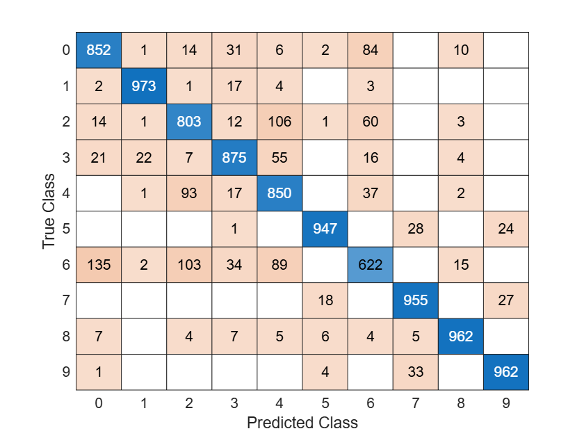

<a id="TMP_4ce1"></a>

# MATLAB vs TensorFlow vs PyTorch

Compare MATLAB vs TensorFlow vs PyTorch on the fashion MNIST dataset 👕👖🩳👔🧥👗👜🩴👟👠

<!-- Begin Toc -->

## Table of Contents
&emsp;&emsp;[Get fashion MNIST dataset](#TMP_5a68)
 
&emsp;&emsp;[Implement the neural network](#TMP_26a6)
 
&emsp;&emsp;[Export to TensorFlow](#TMP_0da2)
 
<!-- End Toc -->

**Resources**


[Call Python AI libraries from MATLAB | matlab\-with\-python\-book](<https://yanndebray.github.io/matlab-with-python-book/5_Call_Python_AI_libraries_from_MATLAB.html#52-call-tensorflow-from-matlab>)


[Basic classification: Classify images of clothing  |  TensorFlow Core](https://www.tensorflow.org/tutorials/keras/classification)


[Quickstart — PyTorch Tutorials 2.8.0+cu128 documentation](https://docs.pytorch.org/tutorials/beginner/basics/quickstart_tutorial.html)

<a id="TMP_5a68"></a>

## Get fashion MNIST dataset

[zalandoresearch/fashion\-mnist: A MNIST\-like fashion product database. Benchmark](https://github.com/zalandoresearch/fashion-mnist)

```matlab
%% Download Fashion-MNIST (once)
dataDir = fullfile(tempdir,"fashion-mnist");
if ~exist(dataDir,'dir'), mkdir(dataDir); end
base = "http://fashion-mnist.s3-website.eu-central-1.amazonaws.com/";
files = ["train-images-idx3-ubyte.gz","train-labels-idx1-ubyte.gz", ...
         "t10k-images-idx3-ubyte.gz","t10k-labels-idx1-ubyte.gz"];
for f = files
    raw = fullfile(dataDir, erase(f,".gz"));
    if ~isfile(raw)
        gz = websave(fullfile(dataDir,f), base+f);
        gunzip(gz, dataDir);
        delete(gz);
    end
end

%% Load into MATLAB arrays ready for trainnet
[XTrain,YTrain] = loadFashionMNIST(dataDir,"train");
[XTest ,YTest ] = loadFashionMNIST(dataDir,"t10k");

size(XTrain)  % 28x28x1x60000
```

```matlabTextOutput
ans = 1x4

28    28    1     60000 

```

```matlab
size(XTest)   % 28x28x1x10000
```

```matlabTextOutput
ans = 1x4

28    28    1     10000 

```

```matlab
categories(YTrain)  % 10 class names
```

```matlabTextOutput
ans = 10x1 cell array

'T-shirt/top'    
'Trouser'        
'Pullover'       
'Dress'          
'Coat'           
'Sandal'         
'Shirt'          
'Sneaker'        
'Bag'            
'Ankle boot'     

```

```matlab

%% --- helpers ---
function [X,Y] = loadFashionMNIST(dataDir, split)
    switch split
        case "train"
            img = fullfile(dataDir,"train-images-idx3-ubyte");
            lbl = fullfile(dataDir,"train-labels-idx1-ubyte");
        case "t10k"
            img = fullfile(dataDir,"t10k-images-idx3-ubyte");
            lbl = fullfile(dataDir,"t10k-labels-idx1-ubyte");
        otherwise
            error("split must be ""train"" or ""t10k"".");
    end
    X = readIDXImages(img);      % 28x28x1xN single in [0,1]
    Y = readIDXLabels(lbl);      % Nx1 categorical
end

function X = readIDXImages(filename)
    fid = fopen(filename,'r','ieee-be');
    magic     = fread(fid,1,'uint32'); assert(magic==2051,"Bad image magic");
    numImages = fread(fid,1,'uint32');
    numRows   = fread(fid,1,'uint32');
    numCols   = fread(fid,1,'uint32');
    raw = fread(fid, numImages*numRows*numCols, 'uint8=>single'); fclose(fid);
    raw = raw/255;
    X = reshape(raw, [numRows,numCols,numImages]);  % row-major → fix orientation
    X = permute(X,[2 1 3]);
    X = reshape(X, [numCols,numRows,1,numImages]);  % 28x28x1xN
end

function Y = readIDXLabels(filename)
    fid = fopen(filename,'r','ieee-be');
    magic     = fread(fid,1,'uint32'); assert(magic==2049,"Bad label magic");
    numItems  = fread(fid,1,'uint32');
    labels    = fread(fid, numItems, 'uint8=>double'); fclose(fid);
    names = ["T-shirt/top","Trouser","Pullover","Dress","Coat", ...
             "Sandal","Shirt","Sneaker","Bag","Ankle boot"];
    Y = categorical(labels,0:9,names);
end
```

```matlab
imshow(XTrain(:,:,1,1))
```


<a id="TMP_26a6"></a>

## Implement the neural network

Interactively

```matlab
deepNetworkDesigner % export the network to the workspace as net_1
```

Or programmatically

```matlab
% Define a neural net architecture programmatically
layers = [
    imageInputLayer([28 28 1])
    fullyConnectedLayer(128)
    reluLayer
    fullyConnectedLayer(10)
    softmaxLayer];  % loss is specified separately
net_1 = dlnetwork(layers)
```

```matlab
% Define training options
options = trainingOptions('adam', ...
    MaxEpochs=5, ...
    MiniBatchSize=64, ...
    InitialLearnRate=1e-3, ...
    Verbose=false, ...
    Plots='training-progress',...
    Metrics="accuracy");

% Train the network
net_1 = trainnet(XTrain, YTrain, net_1, "crossentropy", options);
```

```matlab
testnet(net_1, XTest, YTest, "accuracy")
```

```matlabTextOutput
ans = 88.0100
```

```matlab
scores = predict(net_1,XTest);
classNames = categories(YTest);
YPred = scores2label(scores,classNames);
confusionchart(YTest,YPred)
```


<a id="TMP_0da2"></a>

## Export to TensorFlow
```matlab
save("fashionNet1.mat","net_1")
exportNetworkToTensorFlow(net_1,"fashionNet1")
```

```matlabTextOutput
Warning: Folder "./fashionNet1" already exists. The package files were written to the existing folder. You might need to restart your Python kernel to get the new model definition.
```

